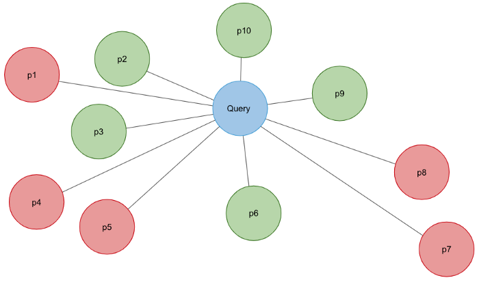
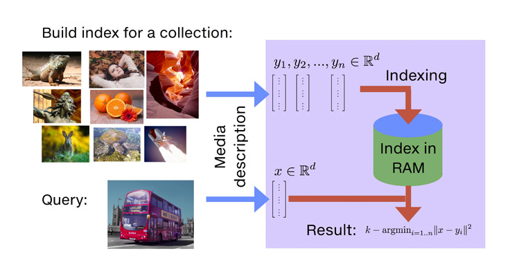
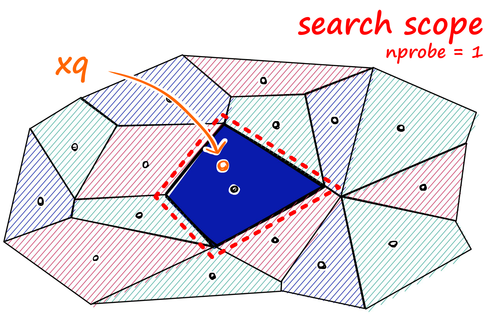

# Using approximate nearest neighbor search in real world applications

> Similarity search

- Traditional databases are made up of structured tables containing symbolic information.
- For example, an image collection would be represented as a table with one row per indexed photo. Each row contains information such as an image identifier and descriptive text.
- Rows can be linked to entries from other tables as well, such as an image with people in it being linked to a table of names.
- The trained Text embedding (word2vec) or convolutional neural net (CNN) models can generate high-dimensional vectors. These representations are much more powerful and flexible than a fixed symbolic representation, as we’ll explain in this post. 
- These new representations cann't be queried with SQL. First, the huge inflow of new multimedia items creates billions of vectors. Second, finding similar entries means finding similar high-dimensional vectors, which is inefficient if not impossible with standard query languages.

Most often, we are interested in finding the most similar vectors. This is called k-nearest neighbor (KNN) search or similarity search and has all kinds of useful applications.

However, a nearest neighbor search is only a part of the process for many applications. For applications doing search and recommendation, the potential candidates from the KNN search are often combined with other facets of the query or request, such as some form of filtering, to refine the results.

> The solution is to integrate the nearest neighbor search with filtering: https://github.com/vespa-engine/vespa

### Finding the (approximate) nearest neighbors

- The representations can be visualized as points in a high-dimension space, even though it’s kind of difficult to envision a space with hundreds of dimensions.
- We can use various distance metrics to measure the likeness or similarity between them. Examples are the dot (or inner) product, cosine angle, or euclidean distance.

- Finding the nearest neighbors of a point is straight-forward: just compute the similarity using the distance metric between the point and all other points. Unfortunately, this brute-force approach doesn’t scale very well, particularly in time-critical settings such as online serving, where you have a large number of points to consider.
- There are no known exact methods for finding nearest neighbors efficiently. A good enough solution for many applications is to trade accuracy for efficiency. In approximately nearest neighbors (ANN), we build index structures that narrow down the search space. 

You can roughly divide the approaches used for ANNs into whether or not they can be implemented using an inverse index.

> The inverse index originates from information retrieval and is comparable to the index often found at many books’ back. This index points from a word (or term) to the documents containing it.

- Using k-means clustering, one can cluster all points and index them by which cluster they belong to.
- A related approach is product quantization, which splits the vectors into products of lower-dimensional spaces. Yet another is locality-sensitive hashing, which uses hash functions to group similar vectors together. These approaches index the centroids or buckets.
- A method that is not compatible with inverted indexes is HNSW (hierarchical navigable small world). HNSW is based on graph structures, is very efficient, and lets the graph be incrementally built at runtime. This is in contrast to most other methods that require offline, batch-oriented index building.

> A good overview of tradeoffs for these can be found at: https://github.com/erikbern/ann-benchmarks/

### Nearest neighbors in search and recommendation

In many applications, such as search and recommendation, the results of the nearest neighbor search is combined with additional facets of the request.

> Text search

Modern text search increasingly uses representation vectors, often called text embeddings or embedding vectors. Word2vec was an early example. More recently, sophisticated language understanding models such as BERT and other Transformer-based models are increasingly used. These are capable of assigning different representations for a word depending upon the context. For text search, the current state-of-the-art uses different models to encode query vectors and document vectors. These representations are trained so that the inner product of these vectors is maximized for relevant results.

> Recommendation

It’s essential to learn the interests or preferences of the user. Such user profiles are represented by one or more vectors, as are the items that should be recommended. These vectors are often generated by using some form of collaborative filtering. One method is matrix factorization, where the maximum inner product is used as a distance function. The problem of filtering is more evident for recommendation systems than for text search. These filters’ quantity and strength lead to a greater probability that items retrieved from the ANN search are filtered away. 

> Serving ads

Given a user profile and a context such as a search query or page content, the system should provide an advertisement relevant to the user. The advertisements are stored with advertiser-specific rules, for instance, who the ad or campaign should target. 

### Faiss

Facebook AI Similarity Search (Faiss), a library that allows us to quickly search for multimedia documents that are similar to each other — a challenge where traditional query search engines fall short. The nearest-neighbor search implementations for billion-scale data sets that are some 8.5x faster than the previous reported state-of-the-art.

- Faiss provides several similarity search methods that span a wide spectrum of usage trade-offs.
- Faiss is optimized for memory usage and speed.
- Faiss offers a state-of-the-art GPU implementation for the most relevant indexing methods.

#### How FAISS Makes Search Efficient

- The first of those efficiency savings comes from efficient usage of the GPU, so the search can process calculations in parallel.
- Additionally, FAISS implements three additional steps in the indexing process. A preprocessing step, followed by two quantization operations — the **coarse** quantizer for inverted file indexing (IVF), and the **fine** quantizer for vector encoding.

#### Preprocessing

The very first step is to transform these vectors into a more friendly/efficient format. FAISS offers several options here.

- PCA : use principal component analysis to reduce the number of dimensions in our vectors.
- L2norm : L2-normalize our vectors.
- OPQ : rotates our vectors so they can be encoded more efficiently by the fine quantizer — if using product quantization (PQ).
- Pad : pads input vectors with zeros up to a given target dimension.

#### Inverted File Indexing

The next step is our inverted file (IVF) indexing process. Again, there are multiple options — but each one is aiming to partition data into similar clusters.

This means that when we query FAISS, and our query is converted into a vector — it will be compared against these partition/cluster centroids.

Figure from: <https://www.pinecone.io/learn/faiss-tutorial/>

We compare similarity metrics against our query vector and each of these centroids — and once we find the nearest centroid (nprobe = 1), we then access all of the full vectors within that centroid (and ignore all others).

> nprobe attribute value — which defines how many nearby cells to search.

Immediately, we have significantly reduced the required search area — reducing complexity and speeding up the search.

#### Vector Encoding

This encoding process is carried out by our fine quantizer. The goal here is to reduce index memory size and increase search speed.

There are several options:

- Flat : Vectors are stored as is, without any encoding.
- PQ : Applies product quantization.
- SQ : Applies scalar quantization.

It’s worth noting that even with the Flat encoding, FAISS is still going to be very fast.

All of these steps and improvements combine to create an incredibly fast similarity search engine — which on GPU is still unbeaten.

> Facebook AI Similarity Search (Faiss): The Missing Manual: https://www.pinecone.io/learn/faiss-tutorial/

## References

- [Faiss: A library for efficient similarity search](https://engineering.fb.com/2017/03/29/data-infrastructure/faiss-a-library-for-efficient-similarity-search/)
- [Using approximate nearest neighbor search in real world applications](https://towardsdatascience.com/using-approximate-nearest-neighbor-search-in-real-world-applications-a75c351445d)
- [Facebook AI Similarity Search](https://towardsdatascience.com/facebook-ai-similarity-search-7c564daee9eb)