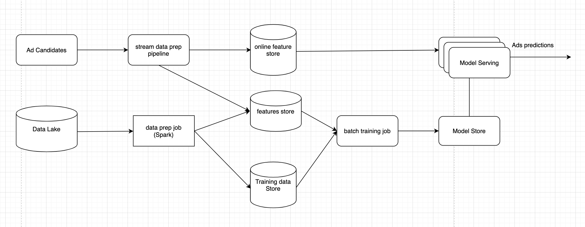

# Ad Click Prediction for Social Networks

## Requirements & Goals

### Functional requirements

- Build a machine learning model to predict if an ad will be clicked. For simplicity reasons, we will not focus on the cascade of classifiers that's commonly used in adtech.
- ML model with good performance

### Non-functional requirements

- System can scale to larger number of users with low latency.
- Imbalance data: you can assume Click Through Rate (CTR) is very small in practice (1%-2%).
- Serving: from the Real-Time Bidding (RTB) workflow diagram, it's important to have low latency (150 ms) for ad prediction.

### Calculate and estimation

- Assumptions: 4K ads requests per second which is 10 billions ads requests per month.
- Data: historical ad clicks data includes `[user, ads, click_or_not]`. With estimated 1% CTR, it has 100 millions clicked ads. We can start with 1 month of data for training and validation.
- Train/validation data split: We split train/validation to simulate the actual online system for example: split by time.
- Features: it's natural that the model need to have enough capacity to learn patterns from big training data. In practice it's common to have hundreds even thousands of features.
- Training: ability to retrain many times within one day to increase model performance in online manner.
- Serving: latency within 150ms per request and 4K request per second.
- Number of predictions: a million per second

### Metrics evaluation

- During the training phase, we can focus on machine learning metrics instead of revenue metrics or CTR metrics. Regarding revenue-related metrics, we usually monitor during deployment.  offline metrics and online metrics.
- Normalized Cross Entropy: predictive log loss divided by the cross entropy of the background CTR. This way NCE is insensitive to background CTR.
- Calibration metrics measured by the expected clicks vs the actual observed clicks.

### Modeling

- Model: We can use probabilistic sparse linear classifier (logistic regression). It's popular because of the computation efficiency and sparsity features.
- Feature engineering: AdvertiserID: it's easy to have millions of advertisers. One common way is to use embedding as a distributed representation for advitiserID.
- Data processing: One way is subsampling majority negative class at different sub-sampling ratio. The key here is ensuring that the validation dataset has the same distribution as the test data set.

### Model deployment and testing

- During deployment phase, it's crucial to monitor the actual CTR and other revenue-related metrics.
- Related to this topic, read more about A/B testing and multi-arms bandit.

> A/B testing: compares the performance of two versions of content to see which one appeals more to visitors/viewers.
> multi-armed bandit: dynamically allocate traffic to variations that are performing well, while allocating less traffic to variations that are underperforming

## High level system design

It’s challenging to be able to train models every few hours to use only up to date data in production. Furthermore, those models need to be easily improvable through feature selection and hyper parameter tuning. This requires the ability to run offline and online tests. 

