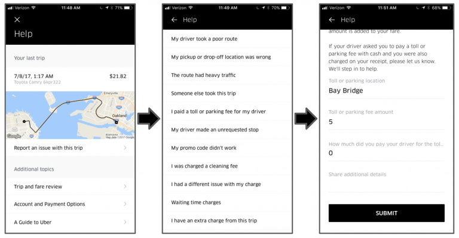

# COTA: Improving Uber Customer Care with NLP & Machine Learning

Customer Obsession Ticket Assistant (COTA), a tool that uses machine learning and natural language processing (NLP) techniques to help agents deliver better customer support.

When customers contact Uber for support, it is important that we route them to the best possible resolution in a timely manner. One way to facilitate this is to have users click through a hierarchy of issue types when they report an issue; this provides our agents with additional context around the issue, thereby enabling them to solve it more quickly, as detailed below:

## Requirements & Goals

### Functional requirements

- Making customer support easier and more accessible.
- Determine the issue type
- Identify the right resolution

### Non-functional requirements

- Hundreds of thousands issues daily
- 600+ cities worldwide
- Supporting multiple languages
- Handle an ever-increasing volume and diversity of support tickets

## High level system design

- Built on top of customer support platform
- Suggest the three most likely issue types and solutions based on ticket content and trip context

### COTA Architecture

1. Once a new ticket enters the customer support platform (CSP), the back-end service collects all relevant features of the ticket.
2. The back-end service then sends these features to the machine learning model in Michelangelo.
3. The model predicts scores for each possible solution.
4. The back-end service receives the predictions and scores, and saves them to our Schemaless data store.
5. Once an agent opens a given ticket, the front-end service triggers the back-end service to check if there are any updates to the ticket. If there are no updates, the back-end service will retrieve the saved predictions; if there are updates, it will fetch the updated features and go through steps 2-4 again.
6. The back-end service returns the list of solutions ranked by the predicted score to the frontend.
7. The top three ranked solutions are suggested to agents; from there, agents make a selection and resolve the support ticket.

To accomplish the goal, machine learning model leverages features extracted from
- customer support messages
- trip information
- and customer selections in the ticket issue submission hierarchy outlined earlier.

### NLP pipeline

Uber built a NLP pipeline to transform text across several different languages into useful features

- Preprocessing

Cleaning the text by removing HTML tags, tokenizing the message's sentences and remove stopwords, conducting lemmatization to convert words in different inflected forms into the same base form

- Topic modeling: TF-IDF and LSA (Latent Semantic Analysis) to extract topics from rich text data

- Feature engineering

Topic modeling enables us to directly use the topic vectors as features to perform downstream classifications for issue type identification and solution selection.

- With a very high-dimensional feature space and large amount of data to process, training these models becomes challenging

### Pointwise ranking

- Combined cosine similarity features together with other ticket and trip features that matches tickets to solutions
- With over 1,000 possible solutions, for 100s of ticket types, solution space becomes a challenge for the ranking algorithm of distinguishing the fine differences between these solutions
- Learning to rank

One solution:

- Label the correct match between solution and ticket pair as **positive**
- Sample a random subset of solutions that do not match with the ticket and label the pairs **negative**
- Binary classification, e.g., random forest

How Uber actually measured they were successful for handling customer issues?

- Uber performed A/B test experiments online on English language tickets.
- A few key metrics, including model accuracy, average handle time, and customer satisfication score

### Moving to COTA v2 with deep learning

- Building a spark-based deep learning pipeline to productize the second generation of COTA v2
- Given that model performance decays over time, we also built a model management pipeline to automatically retrain models to keep them up-to-date

COTA v1 (a) was built with topic modeling-based traditional NLP and machine learning techniques that incorporate a mixture of textual, categorical, and numerical features, as shown in below:

COTA v2 (b) supports a deep learning architecture with a mixture of input features.

- NLP Pipeline was built to process incoming ticket messages. 
- Topic modeling was used to extract feature representation from the text feature.
- The text feature goes through typical NLP preprocessing such as text cleaning and tokenization, and each word in the ticket is encoded using an embedding layer to convert the word to a dense representation.
- Categorical features are encoded using an embedding layer to capture the closeness between different
categories. 
- Numerical features are batch normalized to stabilize the training process.
- Deep learning can improve the solution’s top-1 prediction accuracy by 16 percent (from 49 percent to 65 percent) for the Contact Type model, and 8 percent (from 47 percent to 55 percent) for the Reply model compared to COTA v1. 

### Challenges with COTA V2

- To leverage Spark for the NLP transformations in a distributed fashion
- Spark computations are typically done using CPU clusters
- Deep learning training runs more efficiently on a GPU-based infrastructure
- use both Spark transformations and GPU training, as well as build a unified Pipeline for training and serving the deep learning model

### COTA v2’s deep learning Spark Pipeline

- Assign tasks to CPUs and GPUs based on which hardware would be most efficient. 
- Defining the pipeline into two stages, one for Spark pre-processing and one for deep learning, seemed like the best way of allocating the work load. 
- By extending the concept of a Spark Pipeline, we can serve models for both batch prediction and real-time prediction services using our existing infrastructure.

> Training

Model training is split into two stages:

- Pre-processing transformations using Spark: All the transformations performed on the data during pre-processing are saved as Spark transformers, which are then used to build a Spark Pipeline for serving. We compute both fitted transformations (transformations that require persisting data, e.g., StringIndexer) and non-fitted transformations (e.g., cleaning up HTML tags from strings etc.) in the Spark cluster.
- Deep learning training using TensorFlow: We leverage the pre-processed data to train the deep learning model using TensorFlow. The trained model from this stage is then merged with the Spark Pipeline generated in step (1).This produces the final Spark Pipeline encompassing the pre-processing transformers and the TensorFlow model, which can be used to run predictions. We are able to combine the Spark Pipeline with TensorFlow model by implementing a special type of transformer called TFTransformer, which brings the TensorFlow model into Spark.

> Serving

- The Spark Pipeline built from training contains both pre-processing transformers and TensorFlow transformations. 
- We extended Michelangelo to support serving generic Spark Pipelines, and utilized the existing deployment and serving infrastructure to serve the deep learning model. The pipeline used for serving runs on a Java Virtual Machine (JVM). 
- The performance we see while serving has a latency of p95 < 10ms, which demonstrates the advantage of low latency when using an existing JVM serving infrastructure for deep learning models.
- By extending Spark Pipelines to encapsulate deep learning models, we were able to leverage the best of both CPU and GPU-driven worlds: 1) the distributed computation of Spark transformations and low-latency serving of Spark Pipelines using CPUs and 2) the acceleration of deep learning model training using GPUs.

### Model lifecycle management Pipeline: keeping models fresh

To prevent COTA v2 model performance from decaying over time, we built a model lifecycle management Pipeline (MLMP) on top of our DLSP. 

Consisting of six jobs in total, it uses the existing APIs from Michelangelo to retrain the model. These jobs form a directed acyclic graph (DAG) with dependency indicated by the arrows:

1. Data ETL: This involves writing a data extraction, basic transformation, and loading (ETL) job to prepare data. It typically pulls data from several different data sources, converting it into the right format and putting it into a Hive database.

2. Spark Transformation: This step transforms raw data (textual, categorical, numerical, etc.) into Tensor format so that it can be consumed by a TensorFlow graph for model training.

3. Data Transfer: Computer clusters with CPUs perform the Spark transformations. Deep learning training requires GPUs to speed up the progress. 

4. Deep Learning Training: Once the data is transferred to the GPU clusters. A job is triggered to open a GPU session with a custom Docker container and start the deep learning training process.

5. Model Merging: The Spark transformers from Step 2 and the TensorFlow model from Step 4 are merged to form the final model.

6. Model Deployment: The final model is deployed, and a `model_id` is generated as a reference to the newly deployed model. External microservices can hit the endpoint using the serving framework of `Thrift` by referencing the `model_id`.

## References

- [COTA: Improving Uber Customer Care with NLP & Machine Learning](https://eng.uber.com/cota/)
- [Scaling Uber’s Customer Support Ticket Assistant (COTA) System with Deep Learning](https://eng.uber.com/cota-v2/)