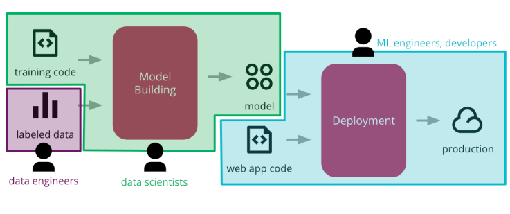
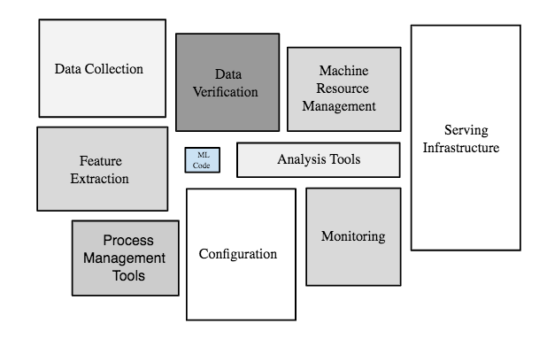
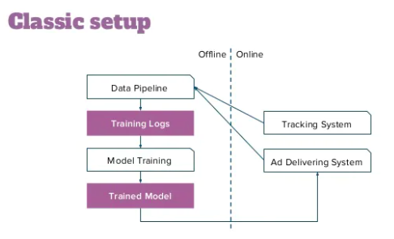
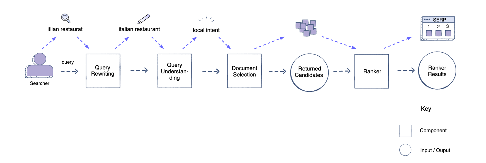

# Machine Learning System Design : An interview framework

Interviewers will generally ask you to design a machine learning system for a particular task. This question is usually broad. 

- The first thing you need to do is to **ask questions to narrow down the scope** of the problem and ensure your system’s requirements. 
- You should also ask questions about **performance and capacity considerations** of the system.

Figure from: [Pooyan Jamshidi, UofSC, CSCE 585: Machine Learning Systems](https://pooyanjamshidi.github.io/mls/lectures/)

Figure from: <https://developers.google.com/machine-learning/crash-course/production-ml-systems>

## Overview

1. Clarify Requirements
2. How the ML system fits into the overall product backend
3. Data Related Activities
4. Model Related Activities
5. Scaling

## Requirements & Goals

### Functional requirements

> What is the goal? Any secondary goal?

- e.g. for CTR, maximizing the number of clicks 
- A secondary goal might be the quality of the ads/content

> Batch prediction
- Hourly, weekly, etc
- Processing accumulated data when you don't need immediate results, e.g. recommendation
- High throughput

> Online prediction
- As soon as requests come
- When predictions are needed as soon as data sample is generated e.g., fraud detection
- Low latency

### Non-functional requirements

1. Reliability: ML system fails, may not give an error, give garbage outputs
2. Scalability: Ask questions about the scale of the system - how many users, how much content?
3. Maintainability: data distribution might get changed, how to re-train and update the model
4. Adaptability: new data with added features, changes in business objectives, should be flexible

## Overview

### Data Related Activities

1. Data Explore - what the dataset looks like?
2. Understand different features and their relationship with the target
  - Is the data balanced? 
  - Is there a missing value (not an issue for tree-based models)
  - Is there an unexpected value for one/more data columns? How do you know if it's a typo etc. and decide to ignore it?
3. Feature Importance - partial dependency plot, SHAP values
4. ML Pipeline - Think of Data ingestion services/storage
5. ML Pipeline - Feature Engineering : encoding categorical features, embedding generation, etc.
6. ML Pipeline - Data split : train set, validation set, test set

> Embeddings enable us to encode entities (e.g., words, docs, images, person) in a low-dimensional vector space in order to capture their semantic information.

### Model Related Activities

1. ML Pipeline - Model Train and Evaluation: How to select a model and hyperparameters?
2. ML Pipeline - Model Train and Evaluation: Once the model is built, do a bias-variance tradeoff, it will give you an idea of overfitting vs underfitting, you need different approaches to make your model better.
3. Draw the ML pipeline 

4. Model Debug
5. Model Deployment
6. ML Pipeline - Performance Monitoring: Metrics
  - AUC, F1, MSE, Accuracy, NDCG for ranking problems etc.
  - When to use which metrics?

You should carefully choose your system’s performance metrics for both online and offline testing. These metrics will differ depending on the problem your system is trying to solve.

- For example, if you are performing binary classification, you will use the following offline metrics: Area Under Curve (AUC), log loss, precision, recall, and F1-score.
- When deciding on online metrics, you may need both component-wise and end-to-end metrics.
- **Component-wise metrics** are used to evaluate the performance of ML systems that are plugged in to and used to improve other ML systems.
- **End-to-end metrics** evaluate a system’s performance after an ML model has been applied. For example, a metric for a search engine would be the users’ engagement and retention rate after your model has been plugged in.

> Offline experiment

- Model training challenge: different use cases in different teams, not the same features, not the same model settings
- Model training steps should be configurable by using configuration objects, formalizing the testing protocol, keeping track of the experiment results
- Evaluation metrics
  - TP, FP, TN, FN
  - Confusion matrix
  - Accuracy, Precision, Recall/Sensitivity, Specificity, F-score (how do you choose among these? imbalanced datasets)
  - ROC curve (TPR vs FPR, threshold selection)
  - AUC (model comparison)

### Architecture

The next step is to design your system’s architecture. You need to think about the system’s components and how the data will **flow through those components**. In this step, you aim to design a model that can scale easily.

### Model Serving

- Embedded model
- Model deployed as a separate service
- Model published as data

### Testing and Quality in ML

- Unit tests to check features are calculated correctly, numeric is normalized, one-hot vector, missing value?
- Test that the exported model still produces the same results (offline vs online)
- Validating the model quality, collecting and monitoring metrics
- Validating model bias and fairness
- Integration test, distribute a **holdout dataset** along with model, and allow to reassess the model's performance against the holdout dataset after it is integrated

### Model deployment

- Multiple models: more than one model performing the same task
- Shadow models: deploy the new model side-by-side with the current one, send the dame production traffic to gather data on how the shadow model performs before promoting it into the production
- Competing models: (1) multiple versions of the model in production - like an A/B test, take some time to gather enough data to make statistically significant decisions. (2) evaluating multiple competing models is multi-armed bandits
- Online learning models: constantly learning in production, extra complexities, version model and data.

### Orchestration in ML pipelines

- Provisioning of infrastructure and the execution of the ML pipelines to train models and capture metrics
- Building, testing, and deploying data pipelines
- Testing and validation to decide which models to promote
- Provisioning of infrastructure and deployment of models to production

## Scaling

To build a scalable system, your design needs to efficiently deal with a **large and continually increasing** amount of data. 

- Scaling for increased demand (same as in distributed systems): scaling web app and serving system, data partitioning
- Data parallelism
- Model parallelism

For instance, an ML system that displays relevant ads to users can’t process every ad in the system at once. You could use the **funnel approach**, wherein each stage has fewer ads to process. This will yield a scalable system that quickly determines relevant ads for users despite the increase in data.

## Real-world examples

- [Machine Learning Platforms](./platform.md)
- [Ad Click Prediction for Social Networks](./Ad.md)
- [COTA: Improving Uber Customer Care with NLP & Machine Learning](./COTA.md)
- [Facebook Newsfeed Architecture](./newsfeed.md)
- [How machine learning powers Facebook’s News Feed ranking algorithm](./ranking.md)
- [Using approximate nearest neighbor search in real world applications](./ANN.md)

## Reference
- [Machine Learning System Design : A framework for the interview day](https://leetcode.com/discuss/interview-question/system-design/566057/Machine-Learning-System-Design-%3A-A-framework-for-the-interview-day)
- [A Look at Machine Learning System Design](https://www.analyticsvidhya.com/blog/2021/01/a-look-at-machine-learning-system-design/)
- [Cracking the machine learning interview: System design approaches](https://www.educative.io/blog/cracking-machine-learning-interview-system-design)
- [Machine Learning for AdTech in Action with Cyrille Dubarry and Han Ju](https://www.slideshare.net/databricks/machine-learning-for-adtech-in-action-with-cyrille-dubarry-and-han-ju)
- [Designing Computer Systems for Machine Learning](https://pooyanjamshidi.github.io/mls/lectures/)
