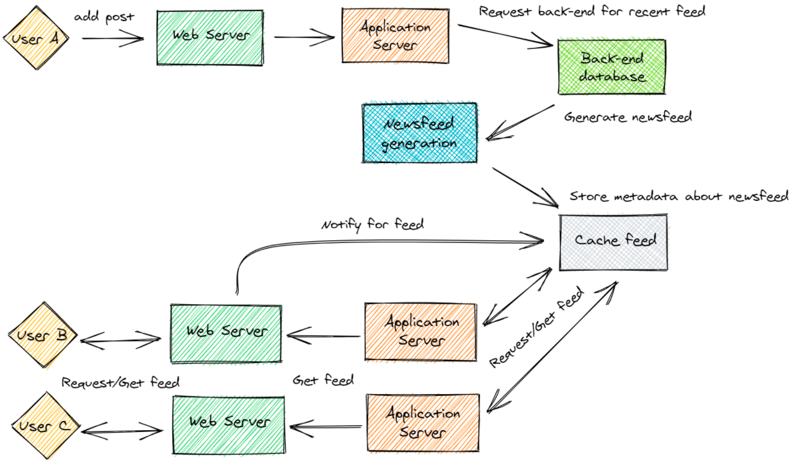
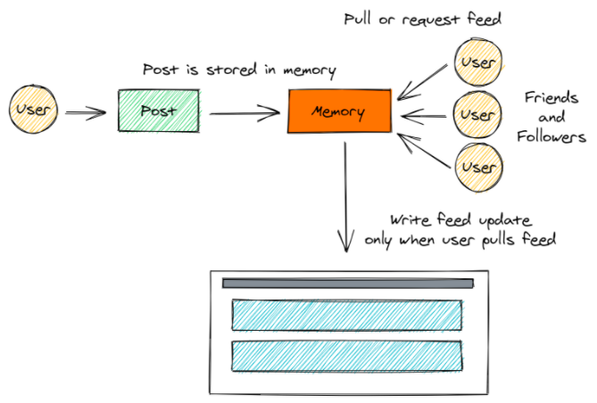
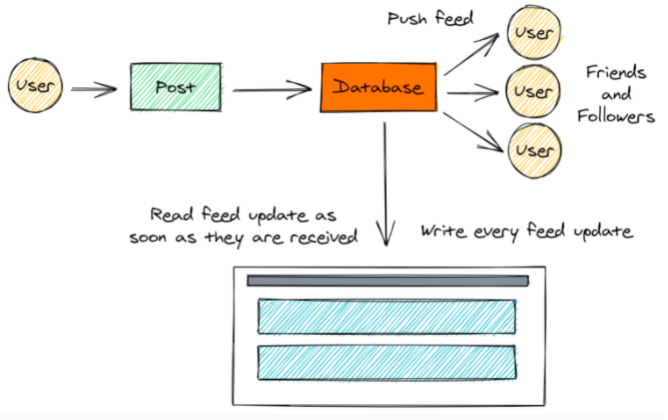

# Facebook Newsfeed Architecture


## Requirements & Goals

### Functional requirements

- Display updates from friends and followers for each specific user


### Non-functional requirements

- Show content to the user according to **its relevance** towards each particular user


## Overview of the System

- It uses a `ranking algorithm` to determine what ontent to show.
- If we describe the system at a higher level, the chain of actions starts when the user `adds or updates` a post on Facebook.
- This post is received by the `web server`, which then sends it to `application servers`.
- These application servers coordinate with the `back-end database` to generate a newsfeed.
- The generated newsfeed is then sent for storage in a `cache feed`.
- Whenever the user asks for a more recent feed, a `feed notification` is sent to servers, then the feed is retrieved by the servers and eventually sent to users that requested it.



Figure from <https://algodaily.com/lessons/dive-into-facebook-newsfeed-architecture>


### System Design

- The most important entity is the `user`, who will be assigned a unique ID along with all the necessary information that is required to create an account (such as birthday, email, etc).
- The other important entity is the `feed item`, which will be assigned a unique `feed_id`, along with content and metadata attributes that should support images and videos.
- There will be two main relationships, that would be a `user - user` relation and `feed item - media` relation. This is because users can be friends with or follow different users, and each feed item will correspond to different media sources.


### Feed Generation

- The feed generation process would take quite a lot of time, especially when dealing with users with a large number of followers.
- The feed can be pre-generated and stored in a `cache memory`, it allows for the faster retrieval of feed items, it also allows for the generation of the feed for offline users or users with poor internet connection.


### Feed Publishing

- `Feed publishing` is the step where feed data is displayed according to each specfic user.
- This can ve a costly action, as the user may have a large number of friends and followers. 
- To deal with this, feed publishing has three approaches:

1. push
2. pull
3. hybrid model


> Pull model or Fan-out-on-load

- When a user creates a post, and a friend reloads their timeline, the feed is created and the pull model `stores` the generated feed in memory.
- The most recent feed is only loaded when the user requests a recent feed.
- This approach reduces the amount of `write operation` from the system database.
- The downside of this approach is that the user will not be able to view recent feeds unless they issue a request to the server.
- Another problem could be the increase in `read` or `load` operations from the server, which may fail to load a user's newsfeed.




> Push model or Fan-out-on-write

- Once a user creates a post, the push model `pushes` or `sends` this post to all the followers immediately.
- This prevents the system from having to go through a user's entire friends and follower list to check for updates on their posts published.
- The `read operations` by the system database is significantly reduced.
- When a user has a large number of friends, as that would result in an increase in number of write operations from the database.




> Hybrid model

- It combines the beneficial features of the above two approaches and tries to provide a balanced approach between the two.
- One method for achieving that would be by allowing only users with a lesser number of followers to use the push model. For users with a higher number of followers, a pull model will be used. 
- This can result in saving a huge number of resources.


### Ranking Newsfeed

- After the feed is generated, each feed item is ranked according to the relevance for each specific user.
- Facebook utilizes an `edge rank algorithm` for ranking all the feed items in the newsfeed for a particular user. The `edge` refers to every small activity on Facebook, such as posts, likes, shares, etc.
- The algorithm utilizes this feature of the network and ranks each edge connected to the user according to relevance.
- Edges with higher ranks will usually be displayed on top of the feed for the user.

The rank for each feed item in Facebook's edge rank algorithm is described by,

```
Rank = Affinity x Weight x Decay
```

- `Affinity`: the closeness of the user to the creator of the edge. If a user frequently likes, comments, or messages the edge creator, then the value of affinity will be higher resulting in a higher rank for the post.
- `Weight`: Content with heavier weight would increase the rank. An example could be, a comment having higher weightage than likes, and thus a post with more comments is more likely to get a higher rank.
- `Decay`: the measure of the creation of the edge. The older the edge, the lesser will be the value of decay and eventually the rank.

These factors combine to give a suitable rank to stories for each specific user. Once the posts are ranked, they are sent to memory or directly retrieved from servers to display on the newsfeed when the user requests it through the feed publishing process.


### Summary

Facebook newsfeed system is constantly updating and changing to optimize for better performance. However, the core technologies to understand the newsfeed system remain the same.


## References

- [A Dive into the Facebook Newsfeed Architecture](https://algodaily.com/lessons/dive-into-facebook-newsfeed-architecture)
