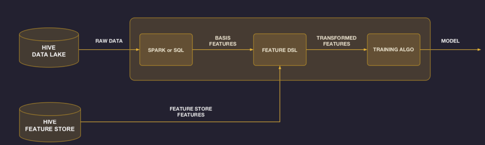
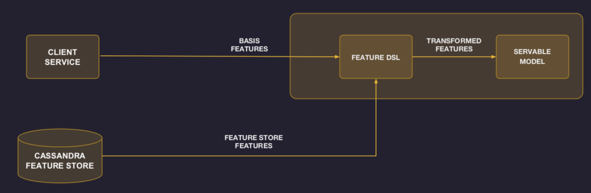
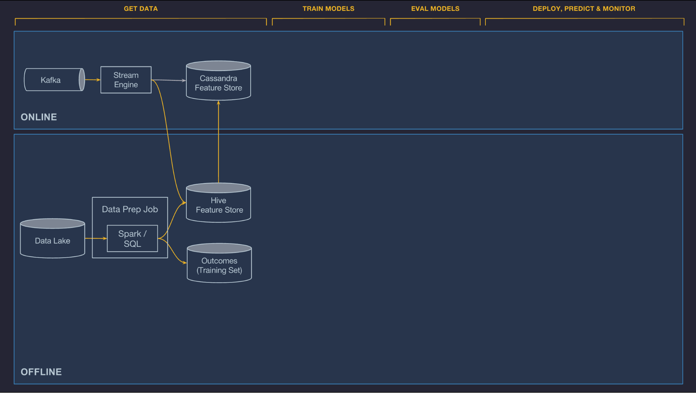
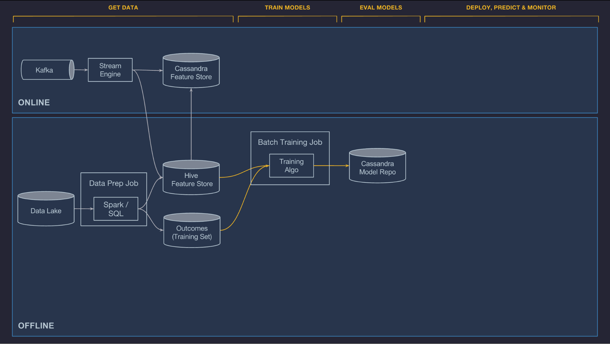
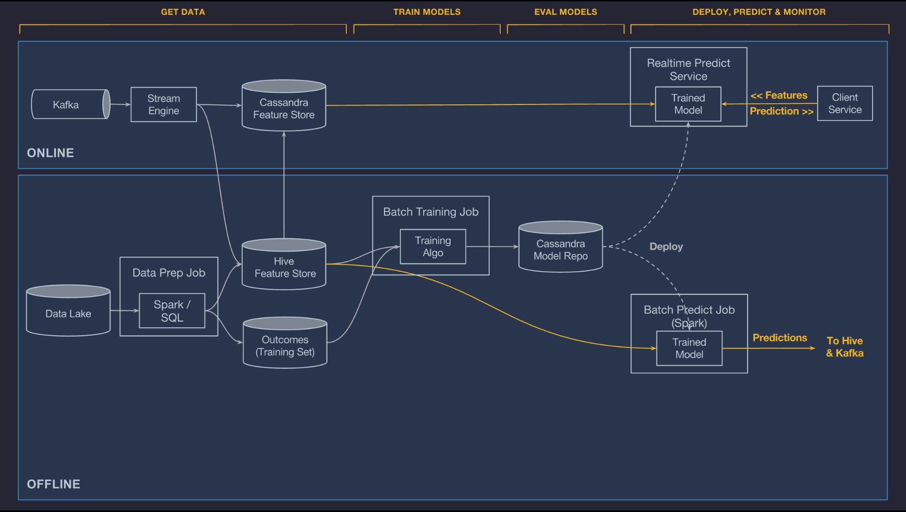
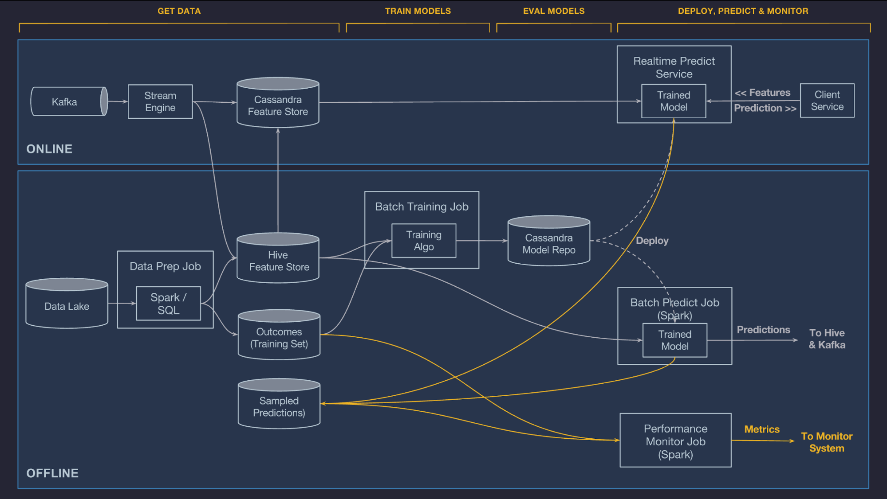

# Machine Learning Platforms

- Review principal components of an ML platform
- Identify key challenges of scaling an ML pipeline to a large number of heterogeneous models
- Define solutions that scale model training and serving

## Requirements & Goals

### Functional requirements

- Enable engineers and data scientists across the company to easily build and deploy machine learning solutions at scale.
- ML at Uber: Uber Eats, ETAs, Autonomous Cars, Customer Support, Dispatch, Personalization, Demand Modeling, Dynamic Pricing

### Non-functional requirements

- Build a production-ready ML pipeline that guarantee reliability, resiliency, responsiveness, and elasticity
- Standardize workflows and tools 
- Provide scalable support for end-to-end ML workflow
- Democratize and accelerate machine learning through ease of use

We designed Michelangelo specifically to provide scalable, reliable, reproducible, easy-to-use, and automated tools to address the following six-step workflow:  

1. Manage data
2. Train models
3. Evaluate models
4. Deploy models
5. Make predictions
6. Monitor predictions

## Key Platform Components

### Feature Store & Feature Engineering

> Feature store problem

- Hardest part of ML is finding good features
- Same features are often used by different models built by different teams

> Feature store solution

- Centralized feature store for collecting and sharing features
- Platform team curates core set of widely applicable features
- Modelers contribute more features as part of ongoing model building
- Meta-data for each feature to track ownership, how computed, where used, etc
- Modelers select features by name & join key. Offline & online pipelines autoconfigured

> Functionality of feature store

- Allow users to easily add features into a shared feature store
- Easy to consume, both online and offline

> Pipeline for offline training with Feature Store

> Pipeline for online serving with Feature Store

> Batch precompute:

- To conduct bulk precomputing and loading historical features from HDFS into Cassandra on a regular basis. 
- 'restaurant’s average meal preparation time over the last seven days.'

> Near-real-time compute:

- Publish relevant metrics to Kafka and then run Samza-based streaming compute jobs to generate aggregate features at low latency. These features are then written directly to Cassandra for serving and logged back to HDFS for future training jobs.
- 'restaurant’s average meal preparation time over the last one hour.'

### Scalable Model Training

- Support offline, large-scale distributed training of decision trees, linear and logistic models, unsupervised models (k-means), time series models, and deep neural networks. 
- The distributed model training system scales up to handle billions of samples and down to small datasets for quick iterations.
- A model configuration specifies the model type, hyper-parameters, data source reference, and feature DSL expressions, as well as compute resource requirements (the number of machines, how much memory, whether or not to use GPUs, etc.). 
- After the model is trained, performance metrics (e.g., ROC curve and PR curve) are computed and combined into a model evaluation report.
- At the end of training, the original configuration, the learned parameters, and the evaluation report are saved back to our model repository for analysis and deployment.
- In addition to training single models, Michelangelo supports hyper-parameter search for all model types as well as partitioned models. With partitioned models, we automatically partition the training data based on configuration from the user and then train one model per partition.

> Model training jobs use Feature Store and training data repository data sets to train models and then push them to the model repository.

### Evaluate models 

Models are often trained as part of a methodical exploration process to identify the set of features, algorithms, and hyper-parameters that create the best model for their problem.

For every model that is trained in Michelangelo, we store a versioned object in our model repository in Cassandra that contains a record of:

- Who trained the model
- Start and end time of the training job
- Full model configuration (features used, hyper-parameter values, etc.)
- Reference to training and test data sets
- Distribution and relative importance of each feature
- Model accuracy metrics
- Standard charts and graphs for each model type (e.g. ROC curve, PR curve, and confusion matrix for a binary classifier)
- Full learned parameters of the model
- Summary statistics for model visualization

### Deploy models

Michelangelo has end-to-end support for managing model deployment via the UI or API and three modes in which a model can be deployed:

1. **Offline deployment**. The model is deployed to an offline container and run in a Spark job to generate batch predictions either on demand or on a repeating schedule.

2. **Online deployment**. The model is deployed to an online prediction service cluster (generally containing hundreds of machines behind a load balancer) where clients can send individual or batched prediction requests as network RPC calls.

3. **Library deployment**. We intend to launch a model that is deployed to a serving container that is embedded as a library in another service and invoked via a Java API. (It is not shown below, but works similarly to online deployment).

- In all cases, the required model artifacts (metadata files, model parameter files, and compiled DSL expressions) are packaged in a ZIP archive and copied to the relevant hosts across Uber’s data centers using our standard code deployment infrastructure. 
- The prediction containers automatically load the new models from disk and start handling prediction requests.
- Many teams have automation scripts to schedule regular model retraining and deployment via Michelangelo’s API. 

> Referencing models

- More than one model can be deployed at the same time to a given serving container. This allows safe transitions from old models to new models and side-by-side A/B testing of models.
- At serving time, a model is identified by its UUID and an optional tag (or alias) that is specified during deployment. 
- In the case of an online model, the client service sends the feature vector along with the model UUID or model tag that it wants to use; in the case of a tag, the container will generate the prediction using the model most recently deployed to that tag.
- In the case of batch models, all deployed models are used to score each batch data set and the prediction records contain the model UUID and optional tag so that consumers can filter as appropriate.
- For A/B testing of models, users can simply deploy competing models either via UUIDs or tags and then use Uber’s experimentation framework from within the client service to send portions of the traffic to each model and track performance metrics.

> Scale and latency

- Since machine learning models are stateless and share nothing, they are trivial to scale out, both in online and offline serving modes.
- In the case of online models, we can simply add more hosts to the prediction service cluster and let the load balancer spread the load. 
- In the case of offline predictions, we can add more Spark executors and let Spark manage the parallelism.
- Online serving latency depends on model type and complexity and whether or not the model requires features from the Cassandra feature store.
- In the case of a model that does not need features from Cassandra, we typically see P95 latency of less than 5 milliseconds (ms). 
- In the case of models that do require features from Cassandra, we typically see P95 latency of less than 10ms. 

### Make predictions

- Once models are deployed and loaded by the serving container, they are used to make predictions based on feature data loaded from a data pipeline or directly from a client service.
- The raw features are passed through the compiled DSL expressions which can modify the raw features and/or fetch additional features from the Feature Store. 
- The final feature vector is constructed and passed to the model for scoring.
- In the case of online models, the prediction is returned to the client service over the network. 
- In the case of offline models, the predictions are written back to Hive where they can be consumed by downstream batch jobs or accessed by users directly through SQL-based query tools

### Monitor predictions

- To make sure that a model is working well into the future, it is critical to monitor its predictions so as to ensure that the data pipelines are continuing to send accurate data.
- Michelangelo can automatically log and optionally hold back a percentage of the predictions that it makes and then later join those predictions to the observed outcomes (or labels) generated by the data pipeline.

## References

- [Meet Michelangelo: Uber’s Machine Learning Platform](https://eng.uber.com/michelangelo-machine-learning-platform/)
