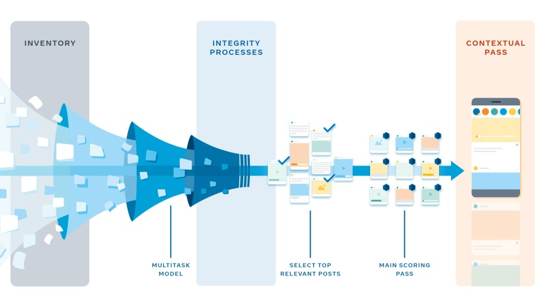
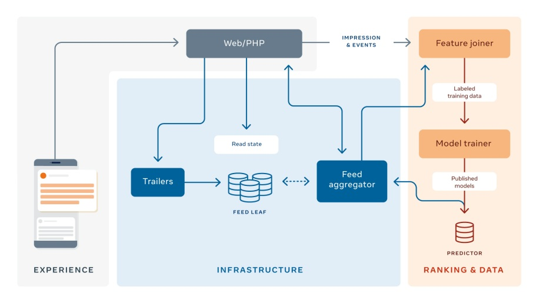

# How machine learning powers Facebook’s News Feed ranking algorithm

## Requirements & Goals

- Designing a personalized ranking system for more than 2 billion people (all with different interests)
- Without machine learning (ML), people’s News Feeds could be flooded with content they don’t find as relevant or interesting
- Predict which content will matter most to each person to support a more engaging and positive experience
- The state-of-the-art ML, such as multitask learning on neural networks, embeddings, and offline learning systems

Figure from <https://engineering.fb.com/2021/01/26/ml-applications/news-feed-ranking/>

## Building a ranking algorithm

- A hypothetical person, Juan, logging in to Facebook,
- His good friend Wei posted a **photo** of his cocker spaniel,
- Another friend, Saanvi, posted a **video** from her morning run,
- His favorite Page published an interesting **article** about the best way to view the Milky Way at night,
- His favorite cooking **Group** posted four new sourdough recipes. 
- To rank some of these things higher than others in Juan’s News Feed, we need to learn **what matters most** to Juan and which content carries the highest value for him.
- For each person on Facebook there are thousands of signals we need to evaluate to determine what that person might find most relevant, so the algorithm gets very complex in practice. 

> On Facebook, one concrete observable signal that an item has value for someone is if they click the like button. 

- Given various attributes we know about a post (who is tagged in a photo, when it was posted, etc.), we can use the characteristics of the post to predict whether Juan might like the post. 
- For example, if Juan tends to interact with Saanvi a lot or share the content Saanvi posts, and the running video is very recent (e.g., from this morning), we might see a high probability that Juan likes content like this.
- On the other hand, perhaps Juan has previously engaged more with video content than photos, so the like prediction for Wei’s cocker spaniel photo might be lower. 
- In this case, our ranking algorithm would rank Saanvi’s running video higher than Wei’s cocker spaniel photo.
- Multiple prediction models provide us with multiple predictions for Juan: a probability he’d engage with (e.g., like or leave a comment on) Wei’s cocker spaniel picture, Saanvi’s running video, the article shared on the Page, and the cooking Group posts.

## Approximating the ideal ranking function in a scalable ranking system

- We need to score all the posts available for more than 2 billion people (more than 1,000 posts per user, per day, on average), which is challenging.
- We need to do this in real time, we need to know if an article has received a lot of likes, even if it was just posted minutes ago. 
- We also need to know if Juan liked a lot of other content a minute ago, so we can use this information optimally in ranking.

Our system architecture uses a **Web/PHP layer**, which queries the **feed aggregator**. The role of the **feed aggregator** is to collect all relevant information about a post and analyze all the features (e.g., how many people have liked this post before) in order to predict the post’s value to the user, as well as the final ranking score by aggregating all the predictions.

Figure from: <https://engineering.fb.com/2021/01/26/ml-applications/news-feed-ranking/>

- When someone opens up Facebook, regardless of the **front-end** interface (e.g., iPhone, Android phone, web browser), the interface will send a request to a **Web/PHP (front-end) layer**, which then queries the **feed aggregator (back-end layer)**. 
- After accepting a request from the front end, the feed aggregator fetches actions and objects, along with an object summary, from the **feed leaf databases** so that it can process, aggregate, rank, and return the resulting list of ranked FeedStories to the front end for rendering.

Now let's review how the aggregator works:

1. Query inventory

- Collect all the candidate posts we possibly rank for Juan (the cocker spaniel picture, the running video, etc.). 
- The eligible inventory includes any non-deleted post shared with Juan by a friend, Group, or Page that he is connected to that was made since his last login. 
-  Fresh posts that Juan has not yet seen but that were ranked for him in his previous sessions are eligible again for him to see. 

2. Score for Juan for each prediction

- Now that we have Juan’s inventory, we score each post using multitask neural nets. 
- There are many features we can use to predict score, including the type of post, embeddings, and what the viewer tends to interact with. 
- To calculate this for more than 1,000 posts, for each of billions of users — all in real time — we run these models for all candidate stories in parallel on multiple machines, called predictors.

3. Calculate a single score out of many predictions

- Multiple passes are needed to save computational power and to apply rules, such as content type diversity (i.e., content type should be varied so that viewers don’t see redundant content types, such as multiple videos, one after another).
- In pass 0, a lightweight model is run to select approximately 500 of the most relevant posts for Juan that are eligible for ranking. This helps us rank fewer stories with high recall in later passes so that we can use more powerful neural network models.
- Pass 1 is the main scoring pass, where each story is scored independently and then all 500 eligible posts are ordered by score.
- Finally, we have pass 2, which is the contextual pass. Here, contextual features, such as content-type diversity rules, are added to help diversify Juan’s News Feed.

Once we’ve completed these ranking steps, we have a scored News Feed for Juan (and all the people using Facebook) in real time, ready for him to consume and enjoy.

## References

- [How machine learning powers Facebook’s News Feed ranking algorithm](https://engineering.fb.com/2021/01/26/ml-applications/news-feed-ranking/)
